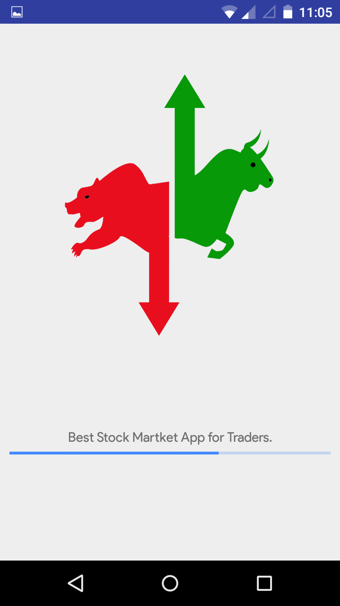
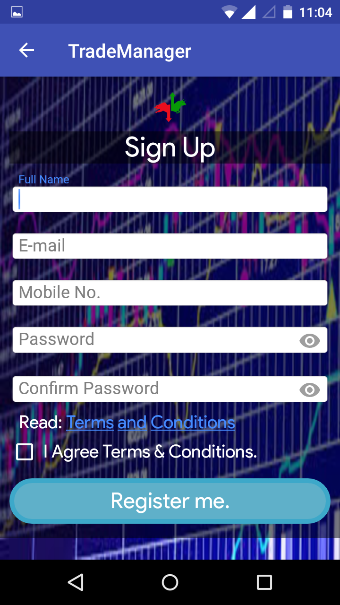
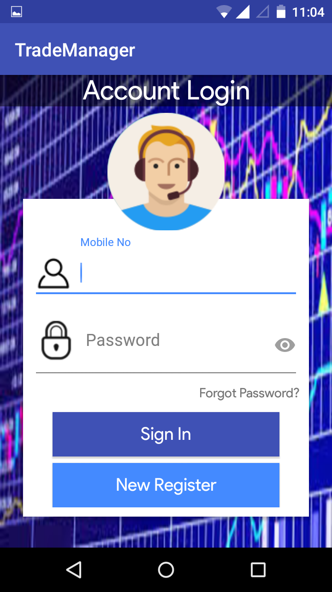
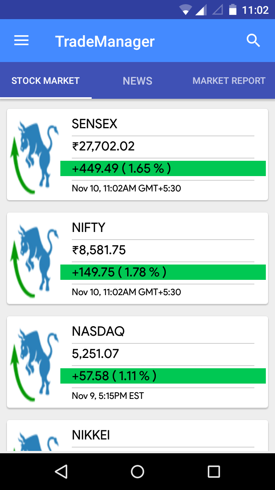
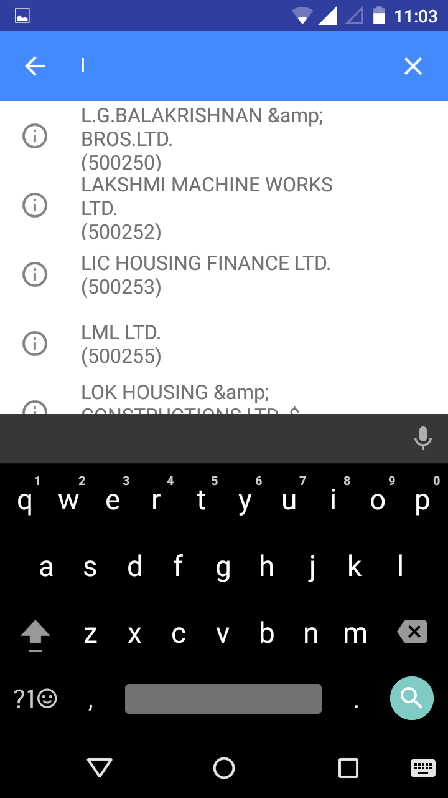
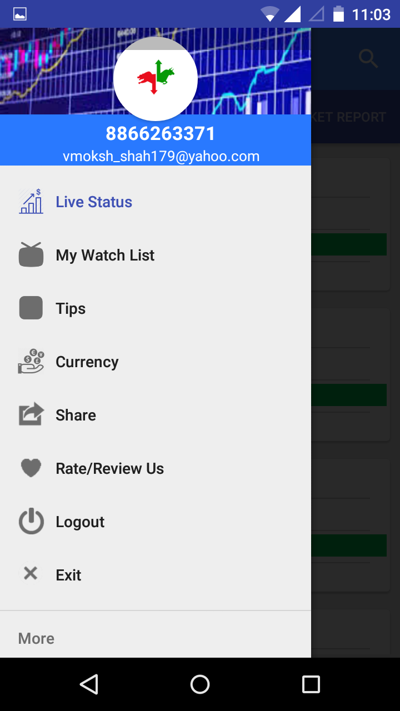
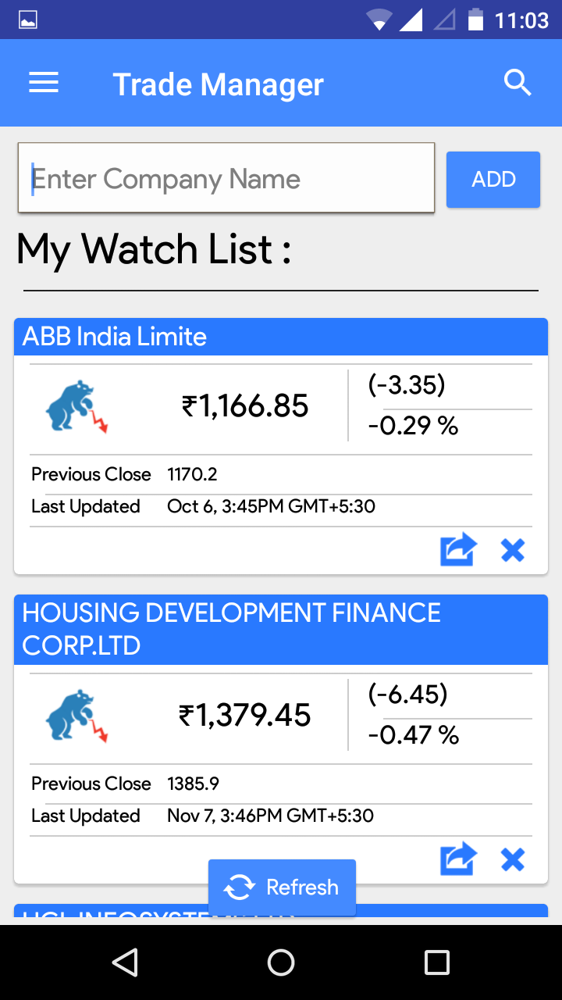
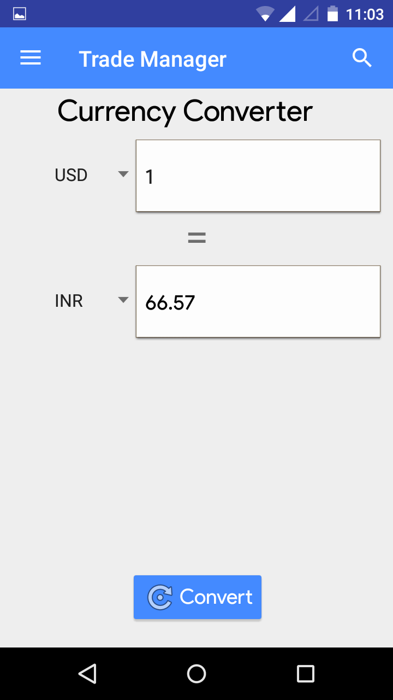
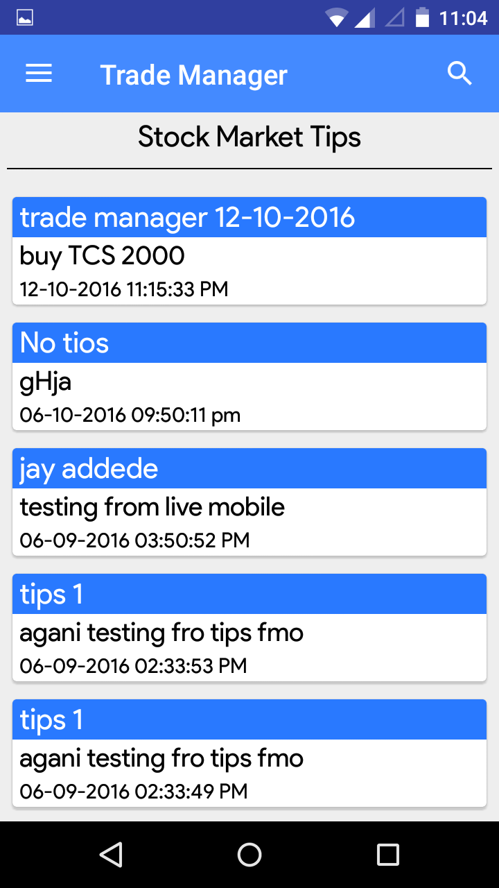
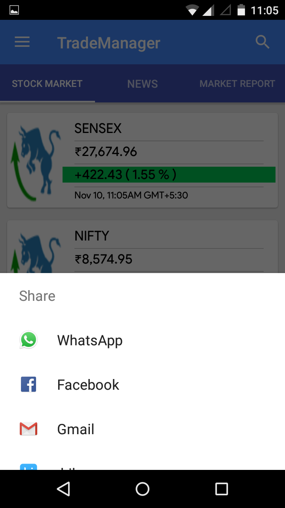

# Trade Manager Android App

## Android Technology/Framework
+ I used
	* Android Studio as IDE
	* Material Designed App
	* Recycler-View
	* Card-View
	* RESTful API( Google Finance API and for Currency Convertor Fixer.io API)
	* JSON
	
## Demo
### Screenshots of the App	
  
  
  
  
  
  
  
  	
  
  
  
  
  